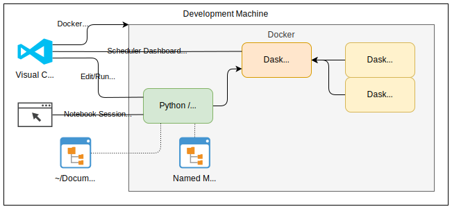

# Purpose
* Run dask multi node sample environment with Jupyter notebook server. 
* User docker compose to spin up two dask nodes and notebook server.
* Guide: is on GitHub https://github.com/dask/dask-docker

drawn with https://www.draw.io/?mode=github

# Features
* Mounts named volume into `/home/jovyan/notebooks` to store files across restarts
* Mounts file share `~/Documents/GitHub` into `/home/jovyan/notebooks/notebooks/GitHub`
* The Jupyter web server is located at http://localhost:8888/
    * The url with the secret token will show up in the logs of the window you started this with
    * use `docker logs dask_notebook_1` to find the URL if detached
* The task scheduler is available on http://localhost:8787/status 
* Open shell command prompt on the notebook server with `docker exec -it dask_notebook_1 /bin/bash`
    * This may not work from a GitHub Bash prompt on Windows

# Docker Management
See README.md in the [root of this repo](../README.md) for interesting docker commands.

# IDE Integration
No IDE integrations specific to this project are called out at this time.