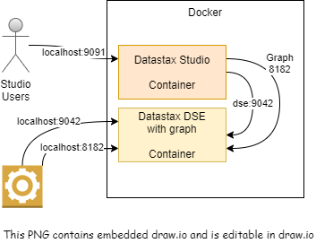

# Purpose
* Manage _Datastax DSE / Cassandra_ server with _Graph_ enabled and the Datastax Studio. 
* Exists as docker-compose to make multi-node easier .

## References
* [Datastax DSE reference](https://docs.datastax.com/en/docker/doc/docker/docker67/dockerDSE.html)
* Good blog article. Debugging info helped let us know what neededed/could need to be configured in docker-compose.yml [Tillman blog](http://www.luketillman.com/datastax-graph-and-studio-with-docker-compose/)
* Datastax sample [GitHub repository](https://github.com/datastax/docker-images/tree/master/example_compose_yamls) with single containers

# Ubuntu - Docker Compose Version
This `docker-compose.yml` file requires a version of docker-compose that supports version 3.8 files because of the network name setting.
At the time of this writing, the official docker-compose in Ubuntu official repositors is version 1.17 which is too old.

This has been tested as working with docker-compose 1.27.4. Some earlier versions probably work.

## Update Ubuntu docker compose.
1. Remove distribution version `sudo apt-get remove docker-compose`
1. Install latest per [official docker instructions](https://docs.docker.com/compose/install/) This example shows latest stable as of 10/2020
    1. `sudo curl -L "https://github.com/docker/compose/releases/download/1.27.4/docker-compose-$(uname -s)-$(uname -m)" -o /usr/local/bin/docker-compose`
    1. `chmod +x /usr/local/bin/docker-compose

# Instructions Start

## Manual Start
1. Start the cluster with `docker-compose up`
1. Wait until it is started **You must see the complete message**
1. Connect your browser to the local studio UI http://localhost:9091/connections
1. Create a connection with _Menu --> Connections_
1. Create a connection called DSE.  
    1. The port is `9042` an
    1. The host is `dse`

# Instructions Stop
## Manual Stop 
1. `ctrl-c`
1. `docker-compose down`

## Optional cleanup volumes 
You can clean up individual volumes or all volumes in your docker environment.
1. You can clean up **ALL** volumes `docker volume prune`

# Features
* Creates named volumes for storage and notebooks to persist across restarts.  You have to remove the named volume to restore to original
* Exposes everything on localhost
* Datastacks DSE is limited to 4GB heap

# Docker Management
See README.md in the [root of this repo](../README.md)

# IDE Integration
No IDE integrations specific to this project are called out at this time.