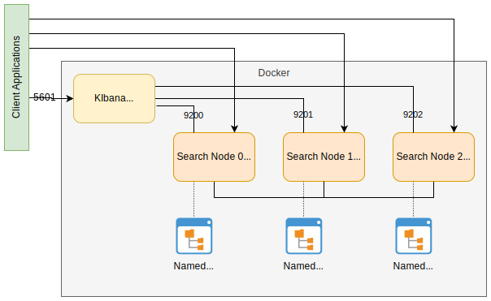

# Purpose
* Manage three node Elasticsearch + Kibana in docker on local machines. 
* Exists as docker-compose to make multi-node easier .
* Guide: https://www.elastic.co/guide/en/elastic-stack-get-started/master/get-started-docker.html

drawn with https://www.draw.io/?mode=github

# Features
* Creates named volumes to persist across restarts.  You have to remove the named volume to restore to original
* Kibana web UI is on http://localhost:5601

# Docker Management
See README.md in the [root of this repo](../README.md) for interesting docker commands.

# IDE Integration
No IDE integrations specific to this project are called out at this time.